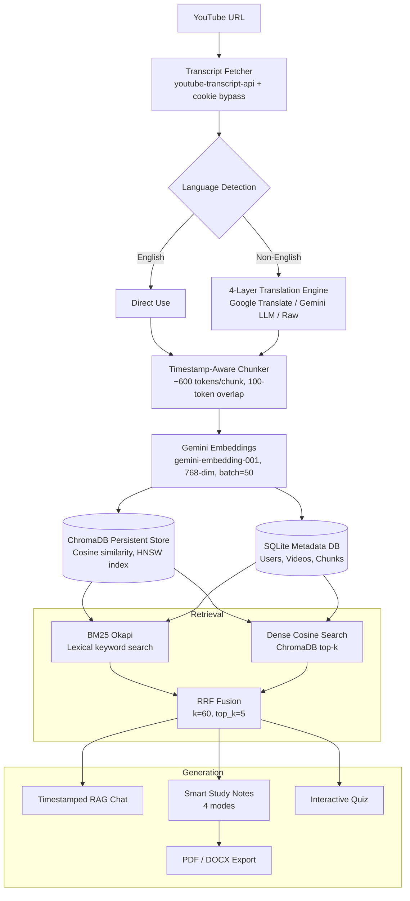

<div align="center">

# LectureMind AI
### Intelligent YouTube Lecture RAG Study Platform and AI Tutor

[](https://www.python.org/)
[](https://fastapi.tiangolo.com/)
[](https://deepmind.google/technologies/gemini/)
[](https://www.trychroma.com/)
[](https://www.langchain.com/)
[](LICENSE)

<p align="center">
  <strong>Transform any YouTube lecture or tutorial into a fully interactive, AI-powered learning workspace.</strong><br>
  Timestamped grounded Q&amp;A &middot; Smart Study Notes &middot; Interactive Quizzes &middot; PDF/DOCX Export &middot; Hybrid BM25+Dense Retrieval &middot; Zero-cost Vector Caching &middot; Multilingual Support
</p>

</div>

---

## Table of Contents

1. [Project Overview](#project-overview)
2. [Motivation and Problem Statement](#motivation-and-problem-statement)
3. [System Architecture](#system-architecture)
4. [Core Technical Pipeline](#core-technical-pipeline)
5. [Key Features](#key-features)
6. [Technology Stack](#technology-stack)
7. [Project Structure](#project-structure)
8. [Data Flow and Storage Design](#data-flow-and-storage-design)
9. [API Reference](#api-reference)
10. [Quickstart and Installation](#quickstart-and-installation)
11. [Configuration](#configuration)
12. [LLM Model Strategy](#llm-model-strategy)
13. [Security and Authentication](#security-and-authentication)
14. [Performance Optimizations](#performance-optimizations)
15. [Limitations and Future Work](#limitations-and-future-work)
16. [License](#license)

---

## Project Overview

**LectureMind AI** is a full-stack, end-to-end **Retrieval-Augmented Generation (RAG)** platform built to eliminate passive video-watching in academic and professional learning. Given any YouTube URL, the system automatically:

1. Fetches and translates the video transcript into English (regardless of source language).
2. Splits the transcript into semantically coherent, timestamp-tagged chunks.
3. Generates dense 768-dimensional embedding vectors and persists them permanently in a ChromaDB vector store.
4. Enables real-time conversational Q&A, structured study-note synthesis, interactive quizzes, and document export — all grounded strictly in the video content.

The platform integrates **Google Gemini** for both embeddings (`gemini-embedding-001`, 768-dimensional) and language generation (`gemini-3.5-flash-lite`), **ChromaDB** as the persistent vector store, **BM25 + cosine-similarity hybrid retrieval** with Reciprocal Rank Fusion (RRF), and **FastAPI** as the web framework with a single-page Jinja2 frontend.

---

## Motivation and Problem Statement

Educational video content on platforms like YouTube is vast and valuable, yet difficult to interact with actively. Learners face three core challenges:

| Challenge | Description |
|:---|:---|
| **Passive Consumption** | Videos require linear viewing; learners cannot query content semantically |
| **No Semantic Search** | No built-in way to find where a specific concept was explained |
| **Language Barriers** | Non-English lectures are inaccessible to many learners worldwide |

Traditional approaches (manual note-taking, YouTube built-in search, or simple keyword search over transcripts) do not address the semantic gap between a learner's natural-language question and the exact phrasing used in the video.

**LectureMind AI** addresses all three by applying the RAG paradigm to video transcripts, with the critical addition of **timestamps** that link every AI-generated answer back to the exact second in the video.

---

## System Architecture



---

## Core Technical Pipeline

### Stage 1 - Transcript Ingestion and Multilingual Translation

**Module:** `app/core/transcript.py`

The transcript pipeline implements a **4-layer language strategy** with graceful degradation:

| Priority | Strategy | Approx. Latency | Gemini Quota |
|:---:|:---|:---:|:---:|
| 1 | English manual transcript - direct use | ~1s | 0 |
| 2 | English auto-generated transcript - direct use | ~1s | 0 |
| 3 | YouTube built-in translation to English | ~2s | 0 |
| 4a | Google Translate via `deep-translator` (primary non-English fallback) | ~10-15s | 0 |
| 4b | Gemini LLM translation (secondary fallback) | ~30-60s | Used |
| 4c | Raw original text (tertiary last resort) | ~0s | 0 |

**YouTube IP-Block Bypass:** The fetcher builds an authenticated `requests.Session` using a prioritized cookie strategy:

1. `cookies.txt` (Netscape format) - most reliable, manually exported from browser
2. Microsoft Edge browser cookies (Windows-native, most likely available)
3. Google Chrome browser cookies
4. Mozilla Firefox browser cookies
5. Plain User-Agent-spoofed session (last resort)

**Translation grouping:** Before translating, segments are merged into natural sentence blocks (~500 characters each). This preserves sentence context, avoids truncation artifacts, and reduces API request count vs. segment-by-segment translation.

---
### Stage 2 - Timestamp-Aware Chunking

**Module:** `app/core/chunking.py`

This is the most technically critical pipeline component. Standard text splitters (e.g., LangChain's `RecursiveCharacterTextSplitter`) lose timestamp information upon splitting. LectureMind AI uses a **two-pass timestamp-preserving chunking algorithm**:

**Pass 1 - Greedy Segment Merging:**
- Iterate over raw transcript segments, each with a `start` and `duration` in seconds.
- Accumulate segments greedily until the token budget (`TARGET_CHUNK_TOKENS = 600`) is reached.
- Close the current chunk and carry forward `OVERLAP_CHARS = 400` characters into the next chunk to prevent answer fragmentation.
- Each chunk records the `start_time` of its first segment and `end_time` of its last - preserving exact citation timestamps.

**Pass 2 - Safety Splitting for Oversized Chunks:**
- Any chunk exceeding `2 x TARGET_CHUNK_TOKENS = 1200` tokens is recursively split via `RecursiveCharacterTextSplitter`.
- Timestamps are distributed *proportionally* across sub-chunks based on character offsets.

**Chunk Parameters:**

| Parameter | Value | Rationale |
|:---|:---:|:---|
| `TARGET_CHUNK_TOKENS` | 600 | Balances context richness with retrieval precision |
| `OVERLAP_TOKENS` | 100 | Prevents answer fragmentation at chunk boundaries |
| `CHARS_PER_TOKEN` | 4 | Conservative estimate for English text |
| `OVERLAP_CHARS` | 400 | Carries linguistic context across boundaries |
| Tokenizer | `cl100k_base` (tiktoken) | GPT-4 standard; robust general-purpose tokenizer |

**ChunkData output dataclass:**

```python
@dataclass
class ChunkData:
    text:        str    # chunk text content
    start_time:  float  # seconds from video start
    end_time:    float  # seconds from video start
    chunk_index: int    # ordered position in the video
```

---
### Stage 3 - Embedding and Vector Storage

**Modules:** `app/core/embeddings.py` and `app/core/vectorstore.py`

**Embedding Model:**

| Property | Value |
|:---|:---|
| Model | `gemini-embedding-001` (also known as `gemini-embedding-1.0`) |
| Vector Dimensions | **768** |
| Task Type (Documents) | `RETRIEVAL_DOCUMENT` |
| Task Type (Queries) | `RETRIEVAL_QUERY` |
| Free Tier | 1,000,000 tokens/day |
| Batch Size | 50 texts/request |
| Batch Delay | 1.0 second between batches (rate-limit safety) |

Gemini embeddings use separate `task_type` contexts for stored documents vs. live queries, mirroring asymmetric bi-encoder architectures (as in Sentence-BERT) and improving retrieval accuracy over symmetric embeddings.

**API Key Pooling:** `GEMINI_API_KEY_2` is preferred for embeddings to preserve `GEMINI_API_KEY` quota for LLM generation (notes, chat, quiz). Automatic failover to `GEMINI_API_KEY` if the secondary key fails or is unset.

**ChromaDB Vector Store Design:**

| Property | Value |
|:---|:---|
| Store Type | Persistent on-disk (`chroma_db/` directory) |
| Collection Isolation | One collection per `video_id` (no cross-video contamination) |
| Similarity Metric | Cosine similarity (`hnsw:space: cosine`) |
| Document ID Format | `{video_id}_chunk_{chunk_index}` |
| Metadata per chunk | `video_id`, `start_time`, `end_time`, `chunk_index` |

The persistent Chroma client is a **module-level singleton** - initialized once and reused across all FastAPI requests, eliminating costly per-request reconnection overhead.

---
### Stage 4 - Hybrid Retrieval (BM25 + Dense + RRF)

**Module:** `app/core/retrieval.py`

LectureMind AI implements **Phase 2 Hybrid Retrieval** combining lexical and semantic search:

| Method | Strength | Weakness |
|:---|:---|:---|
| BM25 (lexical) | Exact keyword matches, technical terms, proper names | No semantic understanding |
| Dense (ChromaDB cosine) | Semantic similarity, paraphrased questions | Can miss exact term matches |
| Hybrid RRF (both fused) | Best of both worlds | Slightly higher latency |

**Reciprocal Rank Fusion (RRF):**

RRF fuses BM25 and dense rankings without requiring score normalization:

$$\text{RRF}(d) = \sum_{r \in \{\text{BM25, Dense}\}} \frac{1}{k + \text{rank}_r(d)}$$

Where `k = 60` is the standard constant that prevents highest-ranked documents from dominating.

**Implementation details:**
- BM25 and dense retrieval each nominate `2 x top_k` candidates.
- RRF scores are accumulated per unique chunk (keyed by `start_time`).
- Final `top_k = 5` chunks are selected for the LLM context window.
- `rank_bm25` is imported at runtime; graceful fallback to dense-only retrieval if not installed.

---
### Stage 5 - Grounded Generation (RAG)

**Module:** `app/core/llm.py`

The Gemini LLM is invoked in three distinct generation modes:

**1. Timestamped Q&A (Chat)**
- Answers grounded exclusively in retrieved transcript context (strict grounding prompt).
- Includes `[MM:SS]` timestamp citations where the answer is grounded.
- Returns `'I don't know based on the lecture content.'` if the answer is absent from context.
- Frontend renders timestamps as clickable `[4:12]` badges that seek the YouTube IFrame player to the exact second.

**2. Smart Study Notes - 4 Generation Modes:**

| Mode | Description |
|:---|:---|
| `summary` - Executive Summary | High-level overview of lecture topics and key conclusions |
| `deep_dive` - Deep Dive Study Guide | Detailed hierarchical notes with section timestamps |
| `cheatsheet` - Formula and Definition Cheatsheet | Extracted equations, key terms, definitions |
| `flashcards` - Flashcard Set | Q&A flashcard pairs for active recall practice |

Notes use ThetaWave/Obsidian-compatible Markdown: callout blocks (`> [!NOTE]`), comparison tables, bold key terms, and section-level timestamps.

**3. Interactive Quiz Engine**
- Structured JSON output of multiple-choice questions (3, 5, or 10, selectable by user).
- Each question includes: question stem, 4 options (A-D), correct answer key, per-option explanation with source timestamp.

---
## Key Features

### Timestamped Grounded AI Tutor (RAG)
- Natural-language questions answered from lecture context only - strict grounding, no hallucination of external facts.
- Clickable timestamp badges jump the embedded YouTube player to the exact cited second.
- Hybrid BM25 + dense retrieval + RRF for maximum answer quality and recall.

### Multi-Mode Smart Study Notes
- **Executive Summary** - bird's-eye overview of the full lecture.
- **Deep Dive Study Guide** - hierarchical notes with section timestamps.
- **Formula and Definition Cheatsheet** - extracted equations, key terms, definitions.
- **Flashcard Set** - active-recall Q&A pairs for spaced repetition study.
- Obsidian/ThetaWave-compatible Markdown with callout blocks, comparison tables, bold key terms.

### 1-Click Document Export
- **PDF** - generated with ReportLab; styled headings, body text, LaTeX math rendered as Unicode.
- **Word (DOCX)** - generated with python-docx; fully editable for academic submission.
- LaTeX math notation converted to Unicode via `pylatexenc` before export.

### Interactive Practice Quiz
- AI-generated multiple-choice questions (3, 5, or 10 selectable).
- Instant scoring with per-option explanation and feedback.
- Source timestamps linked to each answer explanation.

### Zero-Cost Vector Cache (3-Layer Sync)
- ChromaDB embeddings persist permanently on disk across application restarts.
- SQLite tracks ingested videos per user.
- Re-loading any previously processed lecture: **0 embedding API calls, instant response**.
- Cross-user sharing: the same video's embeddings are reused for all users at zero marginal cost.

### Multilingual Auto-Translation
- Supports any language with YouTube captions: Hindi, Spanish, Japanese, French, Arabic, and more.
- 4-layer translation fallback: YouTube native to Google Translate to Gemini LLM to Raw text.
- Natural sentence grouping before translation preserves linguistic and semantic context.

### User Accounts and Isolated Study Libraries
- PBKDF2-SHA256 password hashing with 260,000 iterations and random per-user salt.
- HMAC-SHA256 signed session tokens with configurable secret key.
- Per-user fully isolated lecture library - no cross-user data leakage.
- Guest/demo mode for instant access without registration.

### Dual UI Themes
- **Obsidian Dark** - glassmorphic, distraction-free interface.
- **ThetaWave Light** - clean, minimal interface.
- Instant toggle powered by CSS variable-based theming (no page reload required).

---
## Technology Stack

### Backend

| Component | Technology | Version | Purpose |
|:---|:---|:---:|:---|
| Web Framework | FastAPI | 0.115.0 | REST API and SPA serving |
| ASGI Server | Uvicorn | 0.30.6 | Production-grade async server |
| ORM / Database | SQLAlchemy + SQLite | 2.0.35 | User and video metadata persistence |
| LLM Provider | Google Gemini (`google-genai`) | >=1.0.0 | Chat, Notes, Quiz, Embeddings |
| Embedding Model | `gemini-embedding-001` | - | 768-dim semantic embeddings |
| LLM Models | `gemini-3.5-flash-lite` (primary), `gemini-3.1-flash-lite` (fallback) | - | RAG generation |
| Vector Store | ChromaDB (Persistent) | >=0.5.11 | Semantic similarity search (HNSW) |
| RAG Framework | LangChain | >=0.3.1 | Text splitting utilities |
| Lexical Search | BM25Okapi (`rank-bm25`) | >=0.2.2 | Keyword-based retrieval |
| Tokenizer | tiktoken (`cl100k_base`) | >=0.7.0 | Token-accurate chunk sizing |
| Transcript API | youtube-transcript-api | 0.6.2 | YouTube caption extraction |
| Translation | deep-translator | >=1.11.4 | Non-English transcript translation |
| PDF Export | ReportLab | >=4.2.2 | Styled PDF generation |
| DOCX Export | python-docx | >=1.1.2 | Word document generation |
| LaTeX Converter | pylatexenc | >=2.10 | LaTeX math to Unicode for export |
| HTTP Client | httpx | >=0.27.0 | YouTube metadata fetching |
| Templating | Jinja2 | 3.1.4 | Server-side HTML rendering |
| Config | python-dotenv | 1.0.1 | Environment variable management |

### Frontend

| Component | Technology | Notes |
|:---|:---|:---|
| Architecture | Single Page Application (SPA) | Pure HTML/CSS/JS - no framework dependency |
| Styling | Custom CSS (CSS variables) | Dual-theme system: Obsidian Dark / ThetaWave Light |
| JavaScript | Vanilla JS (`app.js`) | Fetch API, DOM manipulation, theme logic |
| Video Player | YouTube IFrame API | Embedded with timestamp-seek support |

---
## Project Structure

```
YouTube_Chatbot/
├── app/
│   ├── api/                        # FastAPI route handlers (thin controllers)
│   │   ├── auth.py                 # Signup, login, guest auth, profile
│   │   ├── chat.py                 # RAG Q&A with timestamp citations
│   │   ├── notes.py                # Smart notes generation + PDF/DOCX export
│   │   ├── quiz.py                 # Quiz generation and answer scoring
│   │   └── videos.py               # Video ingestion, library management
│   ├── core/                       # Core business and AI logic
│   │   ├── auth.py                 # PBKDF2 password hashing, HMAC token signing
│   │   ├── chunking.py             # Timestamp-preserving two-pass chunker
│   │   ├── embeddings.py           # Gemini embedding-001 with dual-key pooling
│   │   ├── llm.py                  # Gemini LLM: Chat, Notes, Quiz prompt engineering
│   │   ├── retrieval.py            # Hybrid BM25 + Dense + RRF retrieval
│   │   ├── transcript.py           # Multi-layer transcript fetcher and translator
│   │   └── vectorstore.py          # ChromaDB CRUD: store, query, delete collections
│   ├── models/
│   │   └── db.py                   # SQLAlchemy models: User, Video, Chunk metadata
│   ├── static/
│   │   ├── css/
│   │   │   └── style.css           # Dual-theme CSS design system (CSS variables)
│   │   └── js/
│   │       └── app.js              # SPA client logic: fetch, DOM, YouTube IFrame
│   ├── templates/
│   │   └── index.html              # Jinja2 SPA shell
│   └── main.py                     # FastAPI app factory, router registration, startup
├── chroma_db/                       # Persistent ChromaDB vector store (auto-created)
├── data/                            # Supplementary data files
├── .env.example                     # Template environment configuration
├── .gitignore                       # Git exclusion rules
├── cookies.txt                      # (Optional) Netscape-format YouTube cookies
├── requirements.txt                 # Python dependencies with version pins
├── runtime.txt                      # Python runtime version for deployment
└── README.md
```

---
## Data Flow and Storage Design

### SQLite Schema (SQLAlchemy ORM)

| Table | Key Columns | Purpose |
|:---|:---|:---|
| `users` | `id`, `email`, `username`, `password_hash`, `created_at` | User accounts |
| `videos` | `id`, `video_id`, `user_id`, `title`, `channel`, `duration`, `ingested_at` | Video library per user |
| `chunks` | `id`, `video_id`, `chunk_index`, `start_time`, `end_time`, `text` | Transcript chunk metadata |

### ChromaDB Schema

- **One collection per video**, named `vid-{youtube_video_id}`.
- Metadata stored per document: `video_id`, `start_time`, `end_time`, `chunk_index`.
- Similarity metric: **cosine** (`hnsw:space: cosine`).
- HNSW indexing for fast approximate nearest-neighbor search at scale.

### 3-Layer Cache Architecture

```
Request: Process video XYZ
         |
         v
[Layer 1] SQLite check: Is video_id in the videos table for this user?
         | YES -> Return cached metadata immediately (0 API calls)
         | NO
         v
[Layer 2] ChromaDB check: Does collection vid-XYZ exist?
         | YES -> Skip embedding, store only SQLite record (0 embedding API calls)
         | NO
         v
[Layer 3] Full pipeline: Fetch -> Translate -> Chunk -> Embed -> Store ChromaDB + SQLite
```

This design means repeated access to the same video across different users **shares** the same ChromaDB embeddings, consuming zero additional embedding API quota after the first ingestion.

---
## API Reference

Base URL: `http://127.0.0.1:8000`

### Authentication Endpoints

| Method | Endpoint | Auth Required | Description |
|:---:|:---|:---:|:---|
| `POST` | `/api/auth/signup` | No | Register a new user account |
| `POST` | `/api/auth/login` | No | Log in with email and password; returns HMAC session token |
| `POST` | `/api/auth/guest` | No | 1-click instant guest/demo access |
| `GET` | `/api/auth/me` | Yes | Fetch authenticated user profile and usage stats |

### Video Management Endpoints

| Method | Endpoint | Auth Required | Description |
|:---:|:---|:---:|:---|
| `GET` | `/api/videos` | Yes | List all saved lectures for the authenticated user |
| `POST` | `/api/videos/process` | Yes | Ingest a YouTube URL: fetch, chunk, embed, cache |
| `DELETE` | `/api/videos/{video_id}` | Yes | Remove a video from the user library |

### Chat Endpoint (RAG Q&A)

| Method | Endpoint | Auth Required | Description |
|:---:|:---|:---:|:---|
| `POST` | `/api/chat` | Yes | Submit a question; returns a grounded answer with timestamp citations |

Request body:
```json
{
  "video_id": "dQw4w9WgXcQ",
  "question": "What is the main concept explained in the first 5 minutes?"
}
```

Response:
```json
{
  "answer": "The lecture introduces... [2:34] The speaker explains...",
  "sources": [
    { "start_time": 154.0, "end_time": 212.5, "text": "..." }
  ]
}
```

### Smart Notes Endpoints

| Method | Endpoint | Auth Required | Description |
|:---:|:---|:---:|:---|
| `POST` | `/api/notes/generate` | Yes | Generate structured study notes for a video |
| `GET` | `/api/notes/export/pdf` | Yes | Download notes as a styled PDF |
| `GET` | `/api/notes/export/docx` | Yes | Download notes as an editable Word document |

Request body:
```json
{
  "video_id": "dQw4w9WgXcQ",
  "mode": "deep_dive"
}
```

Available modes: `summary` | `deep_dive` | `cheatsheet` | `flashcards`

### Quiz Endpoint

| Method | Endpoint | Auth Required | Description |
|:---:|:---|:---:|:---|
| `POST` | `/api/quiz/generate` | Yes | Generate a multiple-choice quiz (3, 5, or 10 questions) |

### System

| Method | Endpoint | Auth Required | Description |
|:---:|:---|:---:|:---|
| `GET` | `/health` | No | Health check endpoint - returns `{"status": "ok"}` |

---
## Quickstart and Installation

### Prerequisites

- Python 3.10 or higher
- A Google Gemini API key ([get one free at Google AI Studio](https://aistudio.google.com/app/apikey))
- Git

### 1. Clone the Repository

```bash
git clone https://github.com/Aditya8522/LectureMind-AI.git
cd LectureMind-AI
```

### 2. Create a Virtual Environment

```bash
# Windows
python -m venv venv
venv\Scripts\activate

# macOS / Linux
python3 -m venv venv
source venv/bin/activate
```

### 3. Install Dependencies

```bash
pip install -r requirements.txt
```

### 4. Configure Environment Variables

```bash
cp .env.example .env
```

Edit `.env` with your credentials:

```env
# Required - Primary Gemini API Key
# Get yours free at: https://aistudio.google.com/app/apikey
GEMINI_API_KEY=AIzaSy...

# Optional - Secondary key for embedding quota isolation
# Recommended: use Key 2 for embeddings to preserve Key 1 for generation
GEMINI_API_KEY_2=AIzaSy...

# Optional - HMAC signing secret for session tokens
# Strongly recommended for production deployments
AUTH_SECRET_KEY=your_random_secret_key_here
```

### 5. (Optional) Configure YouTube Cookies

If YouTube blocks transcript fetching (common on cloud servers or shared IPs), export your browser cookies in Netscape format using the **Get cookies.txt LOCALLY** browser extension and save the file as `cookies.txt` in the project root.

### 6. Launch the Application

```bash
python -m uvicorn app.main:app --port 8000 --reload
```

Open your browser and navigate to:
```
http://127.0.0.1:8000
```

### 7. Usage Workflow

1. **Register** a new account or click **Continue as Guest**.
2. Paste any **YouTube URL** in the input field and click **Analyze Lecture**.
3. Wait for transcript ingestion (~15-60 seconds depending on video length and language).
4. Use the **Chat** tab to ask questions, **Notes** tab to generate study notes, **Quiz** tab to test yourself, or **Export** to PDF/DOCX.

---
## Configuration

| Environment Variable | Required | Description |
|:---|:---:|:---|
| `GEMINI_API_KEY` | **Yes** | Primary Google Gemini API key for LLM generation and embeddings |
| `GEMINI_API_KEY_2` | No | Secondary key for embedding quota isolation (strongly recommended) |
| `AUTH_SECRET_KEY` | No (recommended) | HMAC-SHA256 secret for session token signing |

All configuration is loaded via `python-dotenv` from the `.env` file at startup. Never commit `.env` to version control (it is listed in `.gitignore`).

---

## LLM Model Strategy

LectureMind AI uses exclusively **non-thinking Gemini models** for all generation tasks. This is a deliberate engineering decision backed by live API testing:

> **Why non-thinking models?** Gemini thinking models output internal chain-of-thought reasoning before the final answer. For structured output tasks (quiz JSON generation, pipe-delimited translation format), this reasoning text corrupts downstream parsers. Non-thinking models produce clean, complete, and reliably formatted output.

### Verified Model Selection (Live Tested, September 2026)

| Model | Role | Status |
|:---|:---|:---|
| `gemini-3.5-flash-lite` | **Primary** - Chat, Notes, Quiz, Translation | Active - fast, non-thinking, reliable structured output |
| `gemini-3.1-flash-lite` | **Fallback 1** - All tasks | Active - slightly older, equally reliable |
| `gemini-flash-lite-latest` | **Fallback 2** - Alias for latest lite model | Active - future-proofs against version gaps |
| `gemini-embedding-001` | **Embeddings** - 768-dim document and query vectors | Active - stable embedding API |

Each task (Chat, Notes, Quiz) defines its own ordered model list. If a model returns an empty or invalid response, the system automatically retries with the next fallback, ensuring **zero-downtime graceful degradation** even if a specific model version is discontinued.

---

## Security and Authentication

| Security Feature | Implementation |
|:---|:---|
| Password hashing | PBKDF2-SHA256 with 260,000 iterations and random per-user salt |
| Session tokens | HMAC-SHA256 signed tokens with configurable secret key |
| User data isolation | All database queries scoped to the authenticated `user_id` |
| Guest mode | Ephemeral session - no persistent data stored to the database |
| API key protection | Keys loaded only at runtime from environment variables, never hardcoded |
| Static file caching | JS/CSS served with `Cache-Control: no-store` to prevent stale UI after deploys |
| Secrets exclusion | `.gitignore` enforces that `.env` and secret files are never committed |

---
## Performance Optimizations

| Optimization | Description | Impact |
|:---|:---|:---|
| **Persistent ChromaDB** | Vector embeddings survive server restarts | Zero re-embedding cost on restart |
| **3-Layer Cache Check** | Skip embedding if video is already indexed | 0 API calls and instant reload for processed videos |
| **Dual API Key Pooling** | Key 2 handles embeddings; Key 1 handles LLM generation | Effectively doubles the free-tier rate limit |
| **Module-level Chroma singleton** | One client instance reused across all requests | Eliminates per-request DB reconnection overhead |
| **Batch embedding (50/batch)** | Texts embedded in batches of 50 | Stays within free-tier 100 RPM limit |
| **Hybrid retrieval (BM25 + Dense)** | Combines keyword and semantic search with RRF | Higher answer quality vs. dense-only |
| **No-cache JS/CSS headers** | `Cache-Control: no-store` on all static JS and CSS files | Prevents stale frontend after new deployments |
| **Greedy segment merging** | Token-accurate chunk boundaries using `cl100k_base` tokenizer | Better chunk coherence, fewer oversized splits |
| **Cross-user embedding sharing** | Same video's ChromaDB collection reused for all users | Scales to many users at zero marginal embedding cost |

---

## Limitations and Future Work

### Known Limitations

| Limitation | Details |
|:---|:---|
| **No captions, no processing** | Videos without any YouTube captions cannot be ingested |
| **Ingestion latency scales with length** | A 2-hour lecture may take 2-5 minutes to fully ingest and embed |
| **Embedded player dependency** | Timestamp seeking requires the YouTube IFrame to be loaded in the browser |
| **Single-video context per session** | Each chat session is scoped to one video at a time |
| **LLM hallucination risk** | Despite strict grounding prompts, LLMs may occasionally surface content not present in the transcript |
| **Machine translation quality** | Google Translate may introduce errors for low-resource or domain-specific languages |

### Evaluation Dimensions (for Research Extension)

If extending this work for academic evaluation, consider measuring:

1. **Retrieval Recall@K** - Does the correct chunk appear in the top-K retrieved results?
2. **Answer Faithfulness** - Is the answer grounded in retrieved context? (Use RAGAS or TruLens frameworks)
3. **Timestamp Precision** - Are cited timestamps within plus or minus 5 seconds of the correct video moment?
4. **Translation Quality** - BLEU/METEOR scores for multilingual video processing pipelines.
5. **User Satisfaction** - Likert-scale ratings for note quality and quiz difficulty calibration.
6. **Hybrid vs. Dense Ablation** - Compare BM25+Dense+RRF against dense-only retrieval for answer quality.

### Future Work Roadmap

| Area | Proposed Enhancement |
|:---|:---|
| Multi-video RAG | Cross-video question answering for lecture series and course support |
| Speaker Diarization | Identify and label multiple speakers using Whisper or pyannote.audio |
| Real-time Streaming | Stream chunking and embedding as transcript segments arrive |
| Cross-Encoder Re-ranking | Neural re-ranker (e.g., `ms-marco-MiniLM`) for top-K refinement |
| Evaluation Dashboard | Built-in RAGAS / faithfulness scoring UI for quality monitoring |
| LLM Backend Agnosticism | Pluggable providers: OpenAI GPT, Anthropic Claude, local Ollama |
| Dockerized Cloud Deployment | Production guide for Render, Railway, or GCP Cloud Run |
| Concept Knowledge Graph | Extract and visualize concept relationships from lecture content |
| Spaced Repetition Integration | SM-2 algorithm for adaptive flashcard review scheduling |
| Lecture Series Support | Link multiple related videos into a unified study workspace |

---

## License

Distributed under the **MIT License**. See [`LICENSE`](LICENSE) for full terms.

---

## Acknowledgements

- [Google DeepMind](https://deepmind.google/) - Gemini LLM and embedding APIs
- [ChromaDB](https://www.trychroma.com/) - Open-source persistent vector database
- [LangChain](https://www.langchain.com/) - Text splitting utilities
- [youtube-transcript-api](https://github.com/jdepoix/youtube-transcript-api) - YouTube caption extraction
- [FastAPI](https://fastapi.tiangolo.com/) - Modern async Python web framework
- [ReportLab](https://www.reportlab.com/) - PDF generation library
- [rank-bm25](https://github.com/dorianbrown/rank_bm25) - BM25 implementation for Python
- [deep-translator](https://github.com/nidhaloff/deep-translator) - Multi-engine translation library
- [tiktoken](https://github.com/openai/tiktoken) - Fast BPE tokenizer from OpenAI

---

<div align="center">
  <sub>Built with love by <a href="https://github.com/Aditya8522">Aditya Mali</a></sub><br>
  <sub>Star this repository if you find it useful for your research!</sub>
</div>
