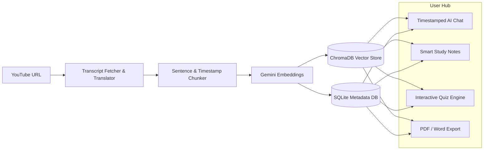

<div align="center">

# 🎓 LectureMind AI
### Intelligent YouTube Lecture RAG Study Platform & AI Tutor

[](https://www.python.org/)
[](https://fastapi.tiangolo.com/)
[](https://deepmind.google/technologies/gemini/)
[](https://www.trychroma.com/)
[](LICENSE)

<p align="center">
  <strong>Transform any YouTube lecture or tutorial into an interactive learning workspace.</strong><br>
  Timestamped grounded AI Q&A, ThetaWave-style smart notes, 1-click PDF/Word exports, interactive quizzes, and permanent ChromaDB vector caching.
</p>

</div>

---

## 🌟 Overview

**LectureMind AI** is a full-stack, retrieval-augmented generation (RAG) platform designed to eliminate passive video watching. By combining **Google Gemini**, **ChromaDB**, and **FastAPI**, LectureMind extracts, translates, chunks, and vectorizes YouTube transcripts so learners can interact with video content in real time.

---

## 🚀 Key Features

- ⏱️ **Timestamped Grounded AI Tutor (RAG)**
  - Ask any conceptual question and receive answers grounded strictly in the lecture context.
  - Interactive clickable timestamp badges (`▶ 04:12`) jump the embedded YouTube player directly to the exact second.

- 📝 **ThetaWave & Obsidian Style Smart Notes**
  - Synthesize long lectures into high-yield, structured study notes.
  - Formatted with callout definitions (`> [!NOTE]`), comparison tables, key takeaways, and section timestamps.
  - Multi-mode generation: **Executive Summary**, **Deep Dive Study Guide**, **Formula & Definition Cheatsheet**, and **Flashcards**.

- 📄 **1-Click PDF & Word (DOCX) Export**
  - Download generated smart notes into beautifully styled PDF and Word files ready for offline revision and printing.

- 🎯 **Interactive Practice Quizzes**
  - Test comprehension with AI-generated multiple-choice questions (3, 5, or 10 questions).
  - Instant scoring, per-option feedback explanations, and review timestamps.

- ⚡ **Zero-Cost Vector Cache (3-Layer Sync)**
  - Embeddings are persisted permanently on disk in **ChromaDB** and indexed in SQLite.
  - Re-analyzing or switching back to a previous lecture uses **0 embedding API quota**.

- 🌐 **Multilingual Auto-Translation**
  - Ingests lectures in non-English languages (such as auto-generated Hindi or regional transcripts), grouping speech into natural sentence blocks and translating to English.

- 👤 **ThetaWave-Style User Accounts & Isolated History**
  - Clean landing page with guest/demo mode.
  - Secure PBKDF2 password hashing and HMAC session signing.
  - Personal study library isolation so each user sees only their saved lectures.

- 🌓 **Obsidian Dark & ThetaWave Light Themes**
  - Minimalist, distraction-free glassmorphic interface with instant theme toggle.

---

## 🏗️ Architecture & Pipeline



---

## 📁 Project Structure

```text
YouTube_Chatbot/
├── app/
│   ├── api/                    # FastAPI route handlers
│   │   ├── auth.py             # User signup, login, guest auth, profile
│   │   ├── chat.py             # RAG Q&A endpoint with citations
│   │   ├── notes.py            # Smart notes generation & PDF/DOCX export
│   │   ├── quiz.py             # Interactive quiz generation & scoring
│   │   └── videos.py           # Video processing, ingestion & library
│   ├── core/                   # Core business & AI logic
│   │   ├── auth.py             # Password hashing & JWT token handling
│   │   ├── chunking.py         # Timestamp-aware sentence text splitting
│   │   ├── embeddings.py       # Google Gemini embedding engine
│   │   ├── export.py           # ReportLab PDF & python-docx builders
│   │   ├── notes_generator.py  # Structured study notes generator
│   │   ├── quiz_generator.py   # Multiple-choice quiz generator
│   │   ├── rag.py              # Context retrieval & Gemini chat engine
│   │   ├── transcript.py       # YouTube transcript parser & translator
│   │   └── vectorstore.py      # ChromaDB collection manager
│   ├── models/                 # SQLite ORM models (SQLAlchemy)
│   │   └── db.py
│   ├── static/                 # Frontend assets
│   │   ├── css/
│   │   │   └── style.css       # Obsidian & ThetaWave design system
│   │   └── js/
│   │       └── app.js          # Single-page application logic
│   ├── templates/              # Jinja2 HTML templates
│   │   └── index.html
│   └── main.py                 # FastAPI application entrypoint
├── .env.example                # Template environment file
├── .gitignore                  # Git ignore rules
├── requirements.txt            # Python dependencies
└── README.md
```

---

## ⚡ Quickstart & Installation

### 1. Clone the Repository
```bash
git clone https://github.com/Aditya8522/LectureMind-AI.git
cd LectureMind-AI
```

### 2. Create a Virtual Environment
```bash
# Windows
python -m venv venv
venv\Scripts\activate

# macOS / Linux
python3 -m venv venv
source venv/bin/activate
```

### 3. Install Dependencies
```bash
pip install -r requirements.txt
```

### 4. Configure Environment Variables
Copy `.env.example` to `.env`:
```bash
cp .env.example .env
```

Open `.env` and add your **Google Gemini API Key**:
```env
# Primary API Key (Get from https://aistudio.google.com/app/apikey)
GEMINI_API_KEY=AIzaSy...

# Optional Secondary API Key (used as fallback or dedicated chat key)
GEMINI_API_KEY_2=AIzaSy...

# Optional Secret Key for Auth Token Signing
AUTH_SECRET_KEY=your_secret_key_here
```

### 5. Launch the Application
```bash
python -m uvicorn app.main:app --port 8000 --reload
```

Open your browser and navigate to:
```text
http://127.0.0.1:8000
```

---

## 🔌 API Endpoints Summary

| Method | Endpoint | Description |
| :--- | :--- | :--- |
| `POST` | `/api/auth/signup` | Register a new user account |
| `POST` | `/api/auth/login` | Log in with email & password |
| `POST` | `/api/auth/guest` | 1-Click instant demo login |
| `GET` | `/api/auth/me` | Fetch authenticated user profile & stats |
| `GET` | `/api/videos` | List saved lectures for the active user |
| `POST` | `/api/videos/process` | Ingest, chunk, and embed a YouTube video |
| `POST` | `/api/chat` | Ask a grounded question with timestamp citations |
| `POST` | `/api/notes/generate` | Generate structured ThetaWave smart notes |
| `GET` | `/api/notes/export/pdf` | Export smart notes as formatted PDF |
| `GET` | `/api/notes/export/docx`| Export smart notes as Word document |
| `POST` | `/api/quiz/generate` | Generate interactive practice quiz |

---

## 🛡️ License

Distributed under the **MIT License**. See `LICENSE` for more information.

---

<div align="center">
  <sub>Built with ❤️ by <a href="https://github.com/Aditya8522">Aditya Mali</a></sub>
</div>
